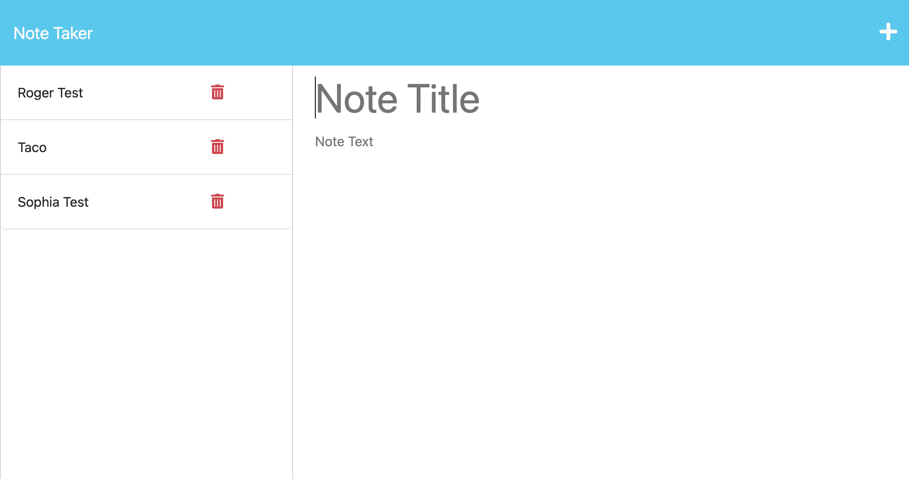
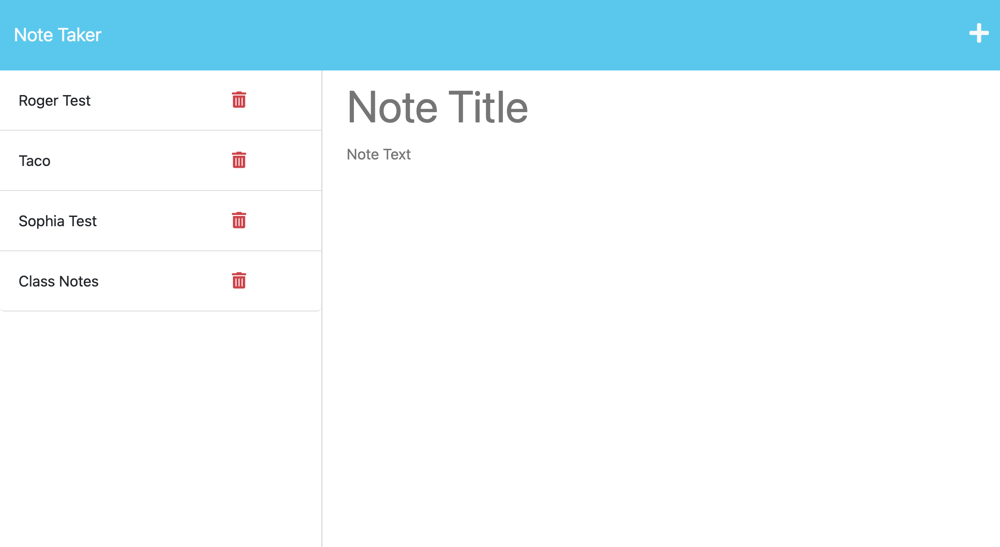

# 11 Express.js: Note Taker

## Description 

This application allows users to write and save notes. It uses an Express.js back end and saves and retrieves note data from a JSON file.

## Table Contents 

- [Installation](#installation)
- [Usage](#usage)
- [Credits](#credits)
- [License](#license)

## Installation

To install the project ... 

* Download the code from the GitHub link [HERE](https://github.com/sophiawilliams16/note-taker). 

* Open up a terminal from `server.js` and run `npm install` in your terminal to download nodejs.  

* Run `nodemon server.js` to connect to the server. It should read  `App listening at http://localhost:3001 🚀`. Follow that link to run the web app on your machine. 

## Usage

To simply write and save notes as a user, click the following [link](https://note-taker-sophiawilliams-783b3e81c275.herokuapp.com/).

The following images show the web application's appearance and functionality:

## Credits 

  - Used Module 11 Activities as example 
  - Used Module 11 Mini Project as example 
  - Youtube Series (https://www.youtube.com/watch?v=_1kNqAybxW0&list=PLC3y8-rFHvwhc9YZIdqNL5sWeTCGxF4ya)
  - Tutoring with Dru Sanchez 

## License 

MIT License

Copyright (c) 2023 Sophia Williams

Permission is hereby granted, free of charge, to any person obtaining a copy
of this software and associated documentation files (the "Software"), to deal
in the Software without restriction, including without limitation the rights
to use, copy, modify, merge, publish, distribute, sublicense, and/or sell
copies of the Software, and to permit persons to whom the Software is
furnished to do so, subject to the following conditions:

The above copyright notice and this permission notice shall be included in all
copies or substantial portions of the Software.

THE SOFTWARE IS PROVIDED "AS IS", WITHOUT WARRANTY OF ANY KIND, EXPRESS OR
IMPLIED, INCLUDING BUT NOT LIMITED TO THE WARRANTIES OF MERCHANTABILITY,
FITNESS FOR A PARTICULAR PURPOSE AND NONINFRINGEMENT. IN NO EVENT SHALL THE
AUTHORS OR COPYRIGHT HOLDERS BE LIABLE FOR ANY CLAIM, DAMAGES OR OTHER
LIABILITY, WHETHER IN AN ACTION OF CONTRACT, TORT OR OTHERWISE, ARISING FROM,
OUT OF OR IN CONNECTION WITH THE SOFTWARE OR THE USE OR OTHER DEALINGS IN THE
SOFTWARE.

